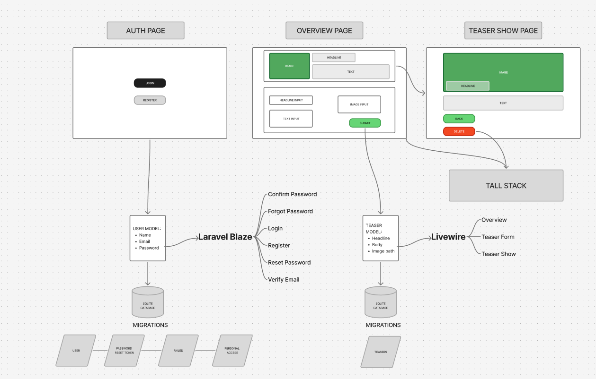

# Laravel Teaser App – TALL Stack

This is a minimal teaser-posting application developed as part of a coding challenge. It allows users to register, log in, and create teaser posts that include a headline, text, and an image. The app is built using the TALL stack (Tailwind CSS, Alpine.js, Laravel, Livewire) and follows clean architecture and Laravel best practices.



[SEE THE FIGMA FILE OF THE SYSTEM DESIGN](https://www.figma.com/board/SY41bjgD94Ltj7IqlXi0hr/Untitled?node-id=0-1&t=qM5eBj4vjC8l99nL-1)


## Features

- User registration and login (Laravel Breeze with Livewire)
- Overview page with teaser submission form
- Responsive teaser list with teaser previews
- Clickable teaser cards leading to detail view
- Teaser deletion functionality
- Blade templating and Livewire for reactive UI
- Tailwind CSS styling with responsive layout
- SQLite database using Eloquent ORM
- File upload (image) with Laravel filesystem
- Clean component structure and validation

## Tech Stack

**Frontend**
- Blade templating engine
- Tailwind CSS
- Livewire
- Alpine.js

**Backend**
- Laravel 11
- Laravel Breeze (Livewire stack)
- Eloquent ORM
- SQLite (for local development)
- Laravel filesystem (public disk)

**Testing**
- PhPUnit
- PhP Dusk


## Installation

### Prerequisites

- PHP >= 8.1
- Composer
- Node.js and npm
- SQLite (or configure a different DB)

### Setup Steps

1. Clone the repository:
   ```bash
   git clone https://github.com/your-username/teaser-app.git
   cd teaser-app

## Installation

### Install PHP dependencies:

```bash
composer install
```

###  Install frontend  dependencies

```bash
npm install
npm run dev
```

###  Create the SQLite database file

```bash
touch database/database.sqlite
```

###  Configure environment variables

```bash
cp .env.example .env
php artisan key:generate

```

###  Run database migrations

```bash
php artisan migrate
```

###  Link the storage directory
```bash
php artisan storage:link
```

###  Start the development server
```bash
php artisan serve
```
